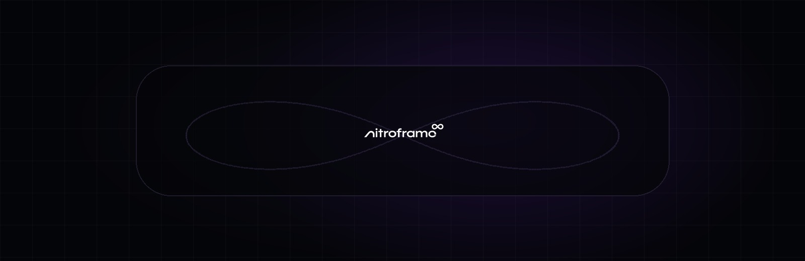
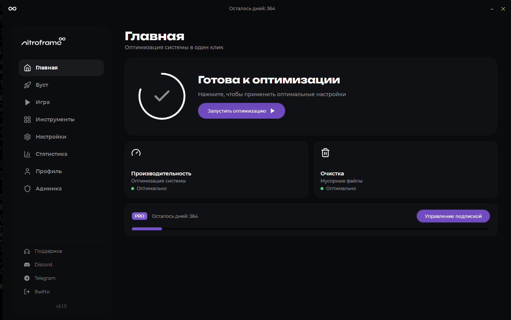
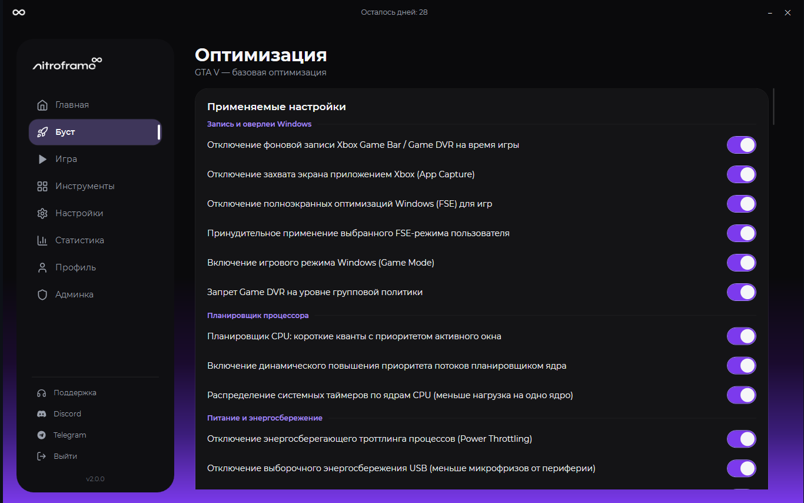
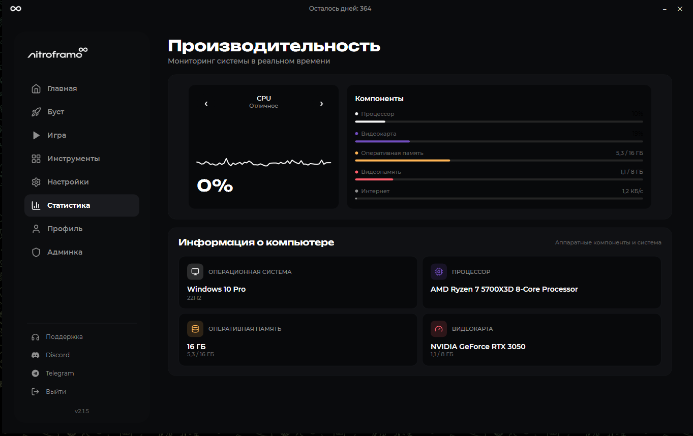
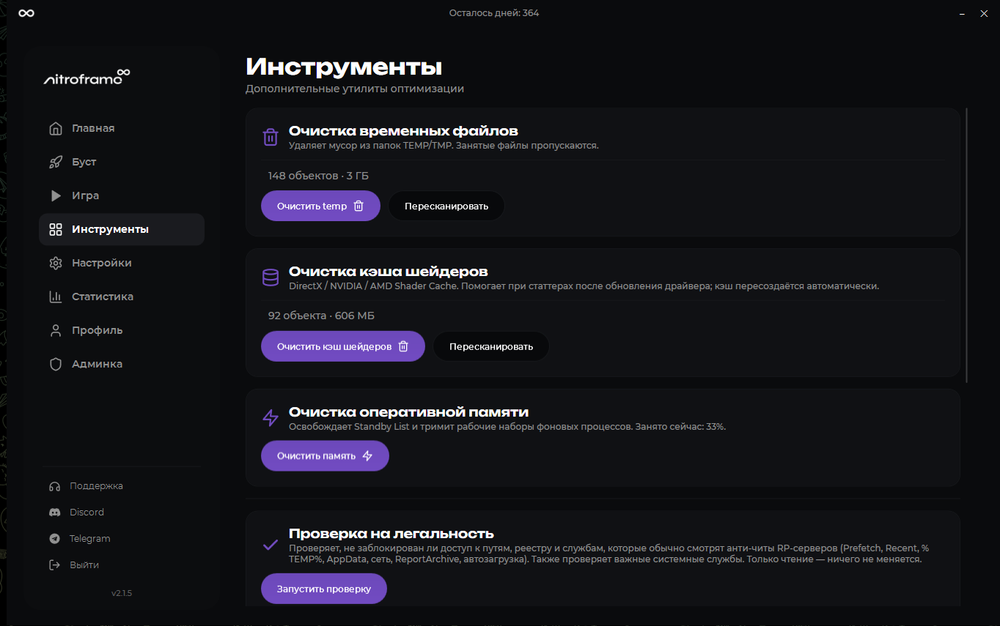
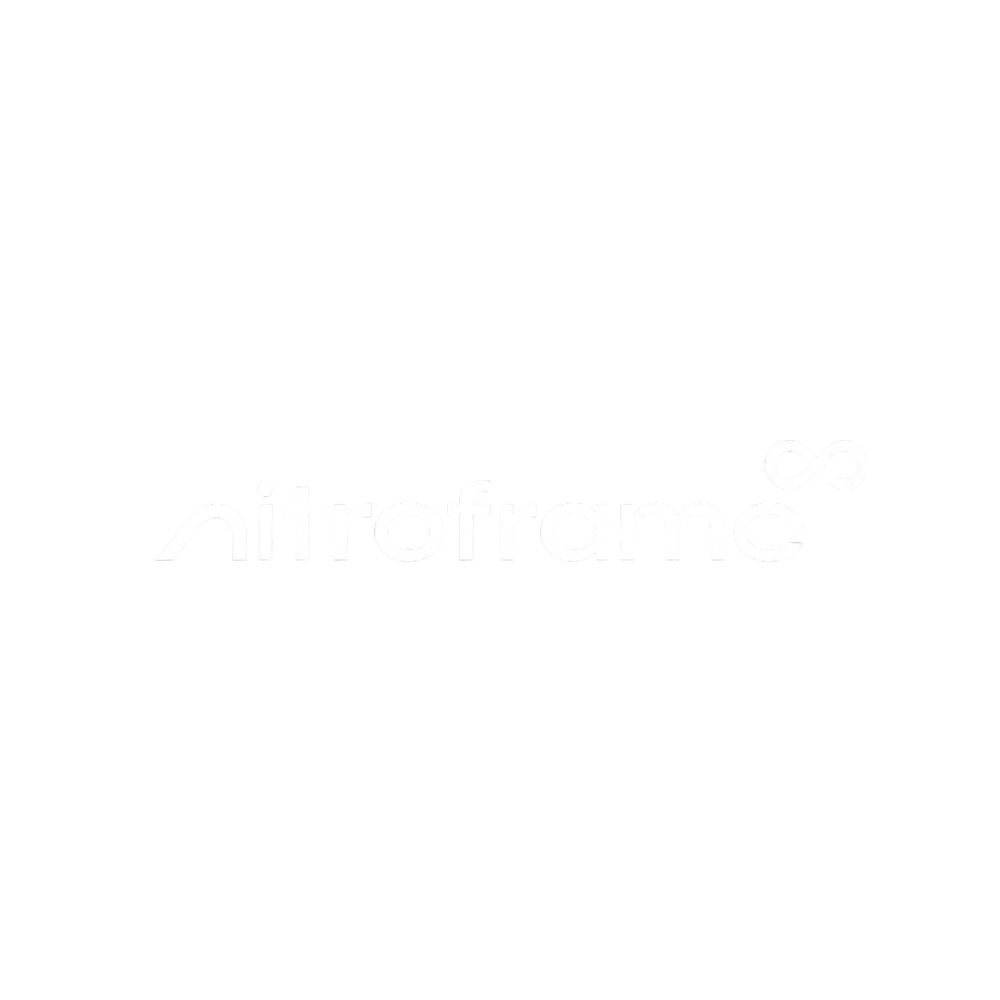

  

   

  **Точная настройка Windows для более стабильной игры — без ручного редактирования реестра и сомнительных сборок.**

   

  
  

    

  
  
  
  

---

## NitroFrame в двух словах

NitroFrame — Windows-приложение для системной и игровой оптимизации. Оно собирает настройки, которые обычно приходится искать по разным утилитам и веткам реестра, в одном понятном интерфейсе: профиль оптимизации, мониторинг оборудования, игровые инструменты и безопасный откат изменений.

Программа рассчитана на пользователей, которым нужна не «магическая кнопка FPS», а контролируемая настройка системы: видно, что включено, изменения можно применить осознанно и при необходимости вернуть обратно.

<table>
<tr>
<td width="50%" valign="top">

### Что умеет

- применяет группы системных твиков из единого профиля;
- создаёт резервное состояние перед изменениями;
- восстанавливает предыдущие параметры;
- отслеживает CPU, GPU, RAM и VRAM;
- показывает состояние системы и игры в реальном времени;
- включает игровой режим и связанные оптимизации;
- хранит пользовательские настройки;
- получает обновления отдельным встроенным модулем.

</td>
<td width="50%" valign="top">

### Почему удобно

- современный интерфейс без перегруженных таблиц;
- настройки сгруппированы по назначению;
- опасные действия не спрятаны за непонятными скриптами;
- есть явный путь назад через восстановление;
- installer сам размещает нужные файлы;
- для обычного использования не требуется Python или среда разработки.

</td>
</tr>
</table>

> [!IMPORTANT]
> NitroFrame меняет системные параметры Windows. Для части действий потребуется подтверждение UAC. Перед применением внимательно читайте названия настроек и не прерывайте процесс восстановления.

## Интерфейс

<table>
<tr>
<td width="50%"></td>
<td width="50%"></td>
</tr>
<tr>
<td align="center">Главная — быстрый обзор состояния</td>
<td align="center">Оптимизация — группы настроек и восстановление</td>
</tr>
<tr>
<td width="50%"></td>
<td width="50%"></td>
</tr>
<tr>
<td align="center">Производительность — CPU, GPU, RAM и VRAM</td>
<td align="center">Инструменты — дополнительные игровые функции</td>
</tr>
</table>

## Основные возможности

| Раздел | Назначение |
|---|---|
| **Главная** | Краткое состояние приложения, системы и доступных действий |
| **Оптимизация** | Профили твиков, применение выбранных параметров и восстановление |
| **Игра** | Управление игровым сценарием и связанными настройками |
| **Инструменты** | Дополнительные утилиты для подготовки Windows |
| **Производительность** | Мониторинг CPU, GPU, оперативной и видеопамяти |
| **Настройки** | Поведение приложения, интерфейс и сохранённые параметры |

### Контролируемые изменения

NitroFrame работает с настройками Windows и игровыми параметрами без внедрения в процесс игры. Перед применением изменений приложение может сохранить исходное состояние, а раздел восстановления позволяет отменить выбранную конфигурацию.

### Мониторинг оборудования

Встроенная панель показывает загрузку ключевых компонентов компьютера. Это помогает оценивать систему до и после настройки не по ощущениям, а по наблюдаемым показателям.

### Аккаунт и лицензия

В приложении предусмотрены вход в аккаунт, пробный доступ и управление лицензией. Состояние подписки проверяется серверной частью NitroFrame; поддержка доступна через официальные каналы проекта.

## Установка

1. Откройте **[последний релиз](https://github.com/d33vel00per/NitroFrameProject/releases/download/v2.0.0/NitroFrameInstaller.exe)**.
2. В блоке **Assets** скачайте `NitroFrameInstaller.exe`.
3. Запустите installer и подтвердите запрос Windows.
4. Завершите установку и откройте NitroFrame через созданный ярлык.

> [!TIP]
> Если Microsoft Defender SmartScreen показывает предупреждение для новой сборки, проверьте, что файл скачан именно из раздела Releases этого репозитория. Не используйте перезаливы со сторонних сайтов.

## Обновление

NitroFrame проверяет наличие новой версии через отдельный updater. Если автоматическое обновление недоступно, скачайте свежий installer со страницы Releases и установите его поверх текущей версии.

## Системные требования

| | Минимум |
|---|---|
| **ОС** | Windows 10 или Windows 11 |
| **Архитектура** | x64 |
| **Права** | Администратор — для системных твиков |
| **Интернет** | Для входа, лицензии и проверки обновлений |
| **Среда выполнения** | В релизной сборке поставляется вместе с приложением |

## Безопасность и честные ожидания

- NitroFrame не является читом и не внедряется в процесс игры.
- Программа не может гарантировать одинаковый прирост FPS на разных компьютерах.
- Результат зависит от железа, версии Windows, драйверов и исходного состояния системы.
- Используйте восстановление, если конкретная настройка ухудшила стабильность.
- Скачивайте сборки только из официального репозитория.

## Скачать

### Готовы попробовать NitroFrame?

Последняя опубликованная версия · Windows x64

## Поддержка и сообщество

- **Telegram:** [@nitroframeopt](https://t.me/nitroframeopt)
- **Поддержка:** [@nitroframesupp](https://t.me/nitroframesupp)
- **Discord:** [присоединиться к серверу](https://discord.gg/mMsnJZKQRb)
- **Ошибки и предложения:** [GitHub Issues](https://github.com/gothbolique/NitroFrameProject/issues)

При сообщении об ошибке укажите версию NitroFrame, версию Windows и действие, после которого возникла проблема. Не публикуйте ключ лицензии и личные данные.

---

  
   
  Этот репозиторий используется для официальных сборок, документации и загрузок NitroFrame. Исходный код не публикуется.

